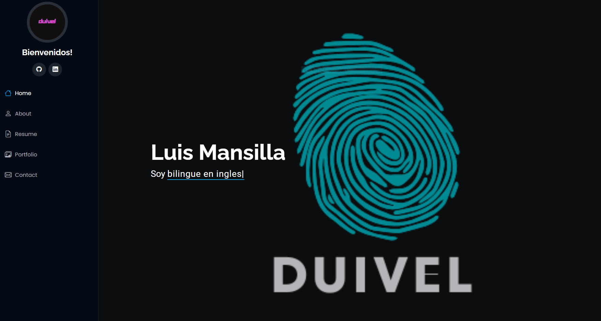
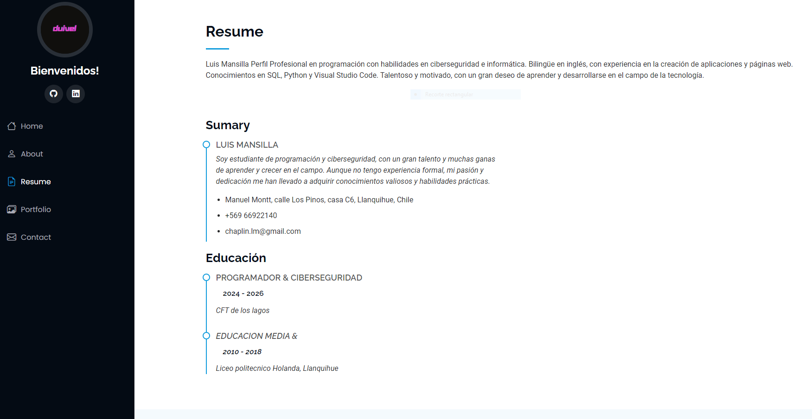
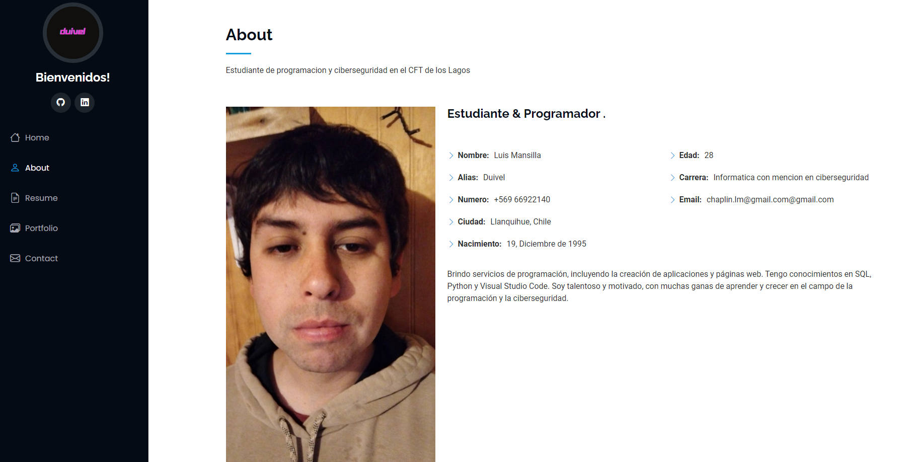
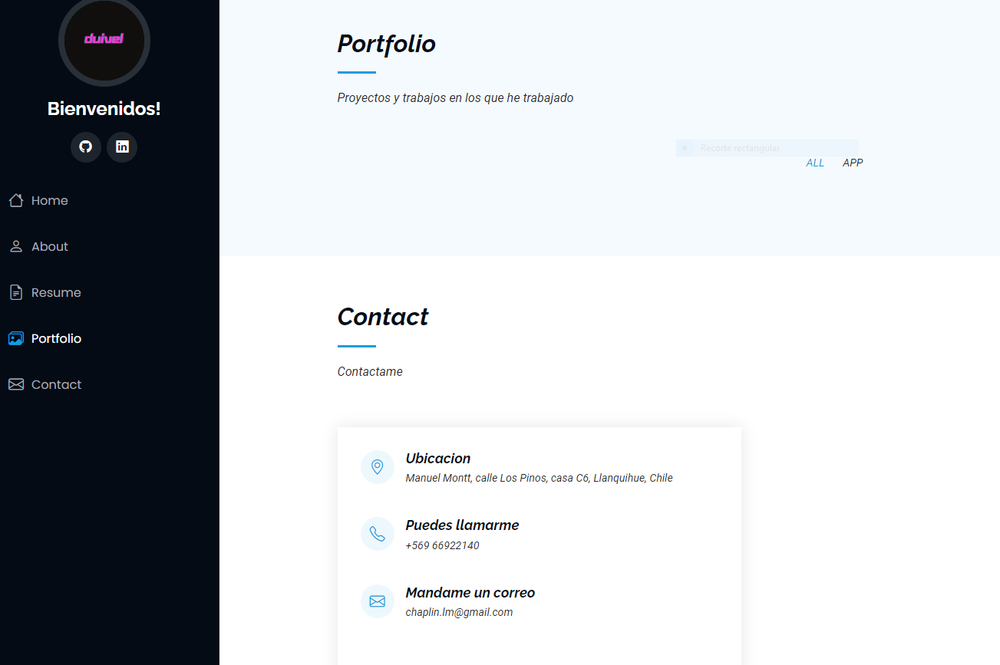
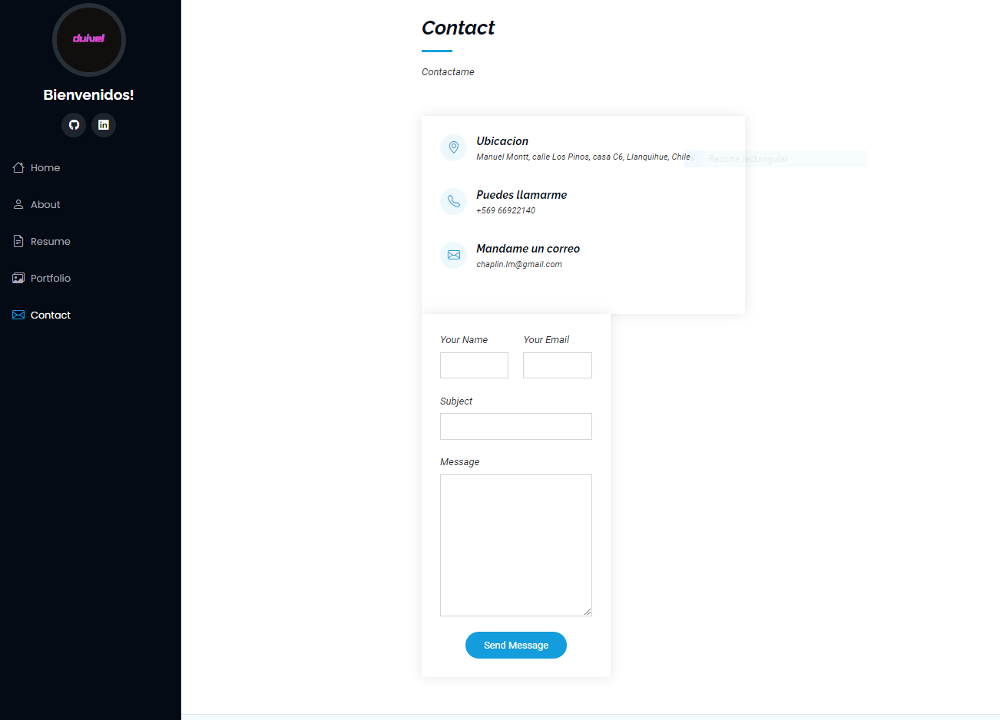

# Examen Final

Este proyecto es una entrega de examen donde se requiere la inclusión de capturas de pantalla de mis notas y la creación de un portafolio funcional, aunque con diseño básico.

## Contenido

1. .png)
2. .png) 
3. .png) 
4. 
5. 

## Portafolio
1. 
2. 
3. 
4. 
5. 

Este portafolio fue creado como parte del examen. A pesar de su diseño simple, cumple con lo pedido por el profesor:

- **Página de Inicio**: Me presento, me llamo Luis Mansilla estudiante de CFT Los Lagos y actualmente curso la carrera de Informatica.
- **Contacto**: https://github.com/duivele.
https://www.linkedin.com/in/luis-mansilla-villarroel-690b5033b/

Para visualizar el portafolio, abre el archivo `index.html` en tu navegador o ejecuta el siguiente comando en la terminal para iniciar un servidor local:

